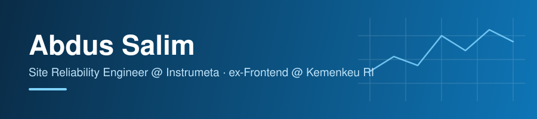

  

  <a href="https://www.abdussalim.my.id">Portfolio</a> ·
  <a href="https://linkedin.com/in/abdussalim">LinkedIn</a> ·
  <a href="mailto:abdussalimsan@gmail.com">Email</a> ·
  <a href="https://bit.ly/WA-Abdus-Salim">WhatsApp</a>
   
  Jakarta / Bandung — remote &amp; hybrid

---

Saya yang jaga **EDUNUSA** tetap jalan — tujuh aplikasi yang dipakai ribuan siswa dan guru tiap hari, dari absen sampai rapor, di 10+ sekolah. Kerjaan hariannya lebih banyak di pipeline, container, dan Vault daripada nulis fitur baru; kalau ada yang rewel pas jam sibuk, itu yang saya benerin duluan. Saya juga pegang tim kecil, 5–6 engineer.

Sebelum ini saya di tim frontend Kemenkeu RI, ikut bangun **SINSW Gen II** (insw.go.id) — sistem buat proses ekspor-impor nasional. Dua modul yang paling berantakan, PPBJ dan SKBPPN, sempat saya rapikan sampai orang baru nggak perlu berminggu-minggu buat ngerti codebase-nya.

Latar belakang saya sebenarnya fisika, bukan IT — geofisika di ULM, skripsi soal sedimen sungai yang kepublish di [Heliyon/Elsevier](https://doi.org/10.1016/j.heliyon.2023.e16425). Dari situ saya nyasar ke IoT, lanjut ke web, dan sekarang malah betah di infra.

## Stack

| | |
|---|---|
| **SRE / Platform** | Linux · Docker · GitHub Actions · Traefik · Vault · Kubernetes · Terraform · Prometheus/Grafana |
| **Cloud** | AWS Solutions Architect Associate + Cloud Practitioner (2025) · EC2 · VPC · IAM · S3 · EKS |
| **Aplikasi** | React · Next.js · TypeScript · Node/Express · Prisma · PostgreSQL · Go |

> [!NOTE]
> Kubernetes, Terraform, dan Prometheus masih tahap lab — saya tulis apa adanya, bukti produksinya nyusul di repo.

## Projects

| Project | Peran & stack | Highlight |
|---|---|---|
| **[EDUNUSA](https://edunusa.co.id)** | SRE — Next.js, Prisma, Postgres, Docker, Traefik, Vault | 5.000+ pengguna harian, 10+ sekolah |
| **[SINSW Gen II](https://insw.go.id)** | Frontend — React, Redux Toolkit, Node | Refactor PPBJ/SKBPPN, onboarding -30% |
| **[toko-zaina-rtsp-recognition](https://github.com/abdussalim/toko-zaina-rtsp-recognition)** | Personal — Python, OpenVINO, NATS, Docker | RTSP AI monitor real-time, repo paling aktif |

## Sekarang

Lagi beresin observability EDUNUSA (Prometheus/Grafana, SLO) pelan-pelan, sambil nyicil Go, Terraform, dan Kubernetes menuju CKA 2026 — belum semuanya kepakai production, masih jujur di tahap belajar. Di luar kerjaan, saya di board **ICCom** (Indonesia Cloud Community) dan ikut riset LLM/AI mingguan di **DF Labs**.

---

<a href="https://linkedin.com/in/abdussalim">linkedin.com/in/abdussalim</a> · <a href="https://www.abdussalim.my.id">abdussalim.my.id</a> · abdussalimsan@gmail.com

